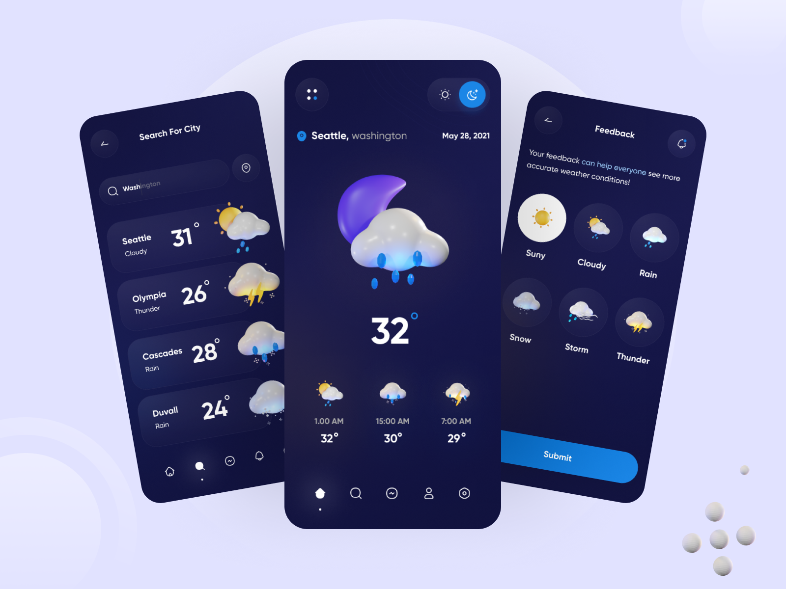

# weatherapp

This is my first Flutter project. I wanted to learn Flutter by doing, so i decided to reproduce a Dribbble design and make it live with real data.

## Design

[Inspiration](https://dribbble.com/shots/16987787-Weather-App) : (from Rasta Mokhtariy)

## API

To get weather data I used https://openweathermap.org API. It was the first time I work with a real API so I have to deal with :
- API_KEYS
- Error handling
- Dart object convertion
- Query param research

## Geolocation

To be able to display the weather from the current location I used [Geolocator](https://pub.dev/packages/geolocator) and Android IOS permission
